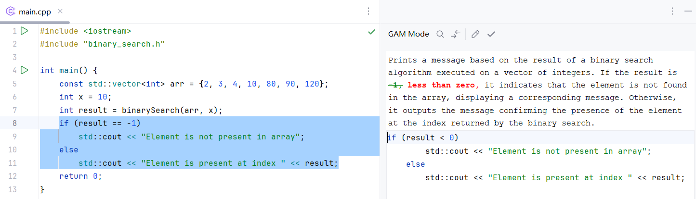

# Grounded Abstract Matching in General Programming

_Ningzhi Tang @ SaNDwich Lab_

Grounded abstraction matching (GAM) was originally proposed by Liu et al. to guide LLM generation to align with user intent.

> “An interface supports **grounded abstraction matching** if the user’s naturalistic utterance is mapped to a system action, and then mapped back to a naturalistic utterance that is an editable example of how to consistently invoke the same action. This gives a grounded example of the level of abstraction at which the system expresses its solutions.”

However, previous work on GAM has been limited to tabular data analysis (CHI 2023) or SQL query writing (EMNLP 2023, UIST 2024). The size of the generated code is limited, and the operations are structured.

Thus, we are interested in extending GAM to general programming tasks. We have built an interface that can generate code summaries for selected code snippets while allowing users to invoke LLMs to modify the code snippets by editing the summaries. We hope this approach will help users understand and modify code more effectively compared to manually writing modification prompts directly.

    

